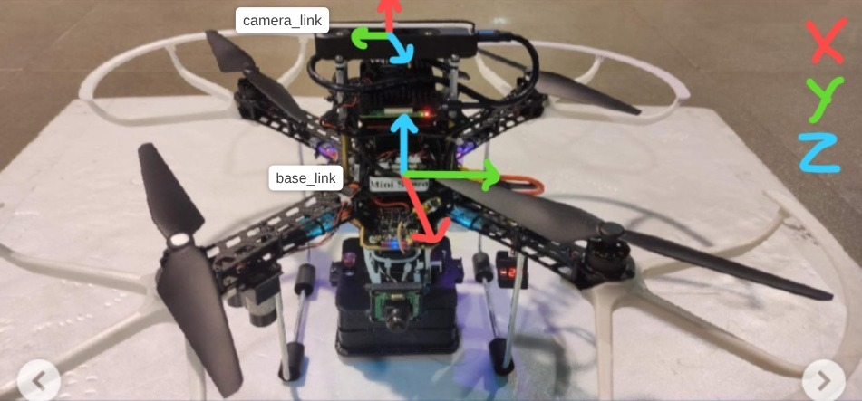
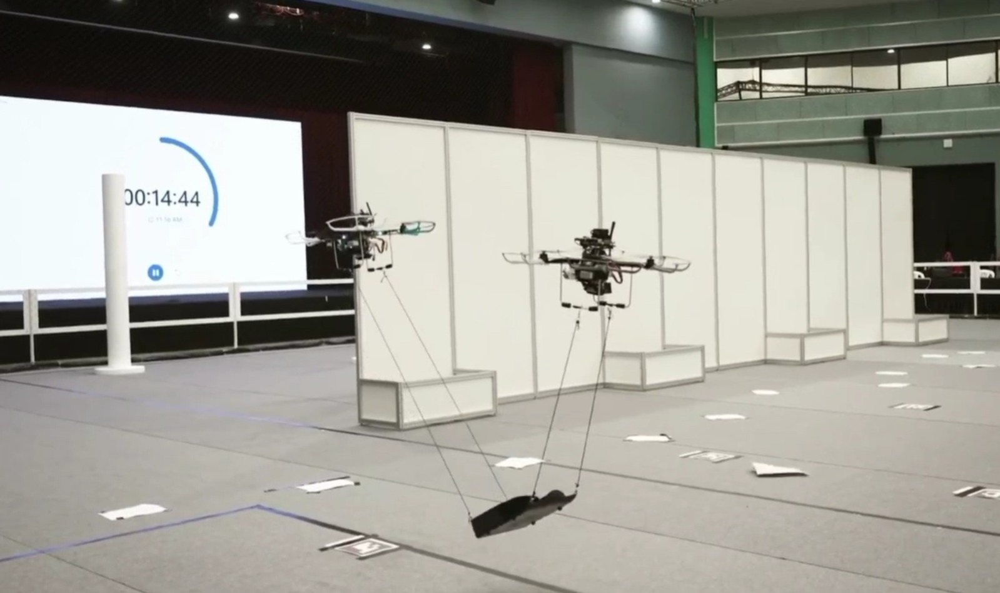

# TUGAS MAGANG PROGRAMMING BAYUCARAKA 2026: MATEMATIKA UAV

Nama: Julianda Caesar Prakoso

NRP: 5025251028

Untuk menyelesaikan salah satu lomba yang mengharuskan 2 drone bekerja sama didalam ruangan tanpa sinyal GPS, tim berencana untuk menggunakan kamera stereo Intel Realsense T265 sebagai sensor utama lokalisasi, driver [bawaan dari intel](https://github.com/realsenseai/realsense-ros) telah menangani algoritma visual inertial odometry yang memberikan anda output stream berupa data posisi lokal (x y z) dan orientasi kamera (quaternion). Namun, karena arena lomba terlalu rapi dan minim fitur, maka tim berencana untuk memasang kamera menghadap keatas (seperti digambar  pertama, posisi offset origin camera_link terhadap base_link adalah `[0.0, 0.0, 0.15]`) karena langit langit venue lomba terbuat dari banyak kerangka besi yang kaya akan fitur visual. Karena visual odometry merupakan metode lokalisasi lokal, maka titik nol (posisi: `0, 0, 0`; orientasi: `1 +  0i + 0j + 0k`) berada di tepat dimana drone pertama kali dinyalakan. Apabila diketahui pada saat dinyalakan posisi drone kedua berada 1.3 meter di kanan drone pertama dengan menghadap ke arah yang berbeda 10 derajat (Sumbu z diatas karena FLU), maka buatlah fungsi dalam bahasa C++ atau Python yang menerima posisi dan orientasi dari kamera stereo drone kedua (`camera_link`) dan juga kamera stereo drone pertama (`camera_link`), kemudian mendapatkan posisi relatif drone kedua terhadap drone pertama dalam sistem koordinat lokal (`base_link`) drone pertama.

**Note:** Dilarang menggunakan scipy.spatial.transform, tf2_ros, atau library lain yang sudah mengimplementasikan transformasi antar dua sistem koordinat. Apabila menggunakan library aljabar linear seperti numpy atau pytorch, hanya boleh digunakan untuk membantu melakukan perkalian titik ke matrix. Tugas ini bukan tugas membuat wrapper dari tools/library yang sudah ada, tetapi untuk melatih anda menentukan matrix transformasi dan juga mengubah orientasi quaternion antar 2 sistem koordinat.