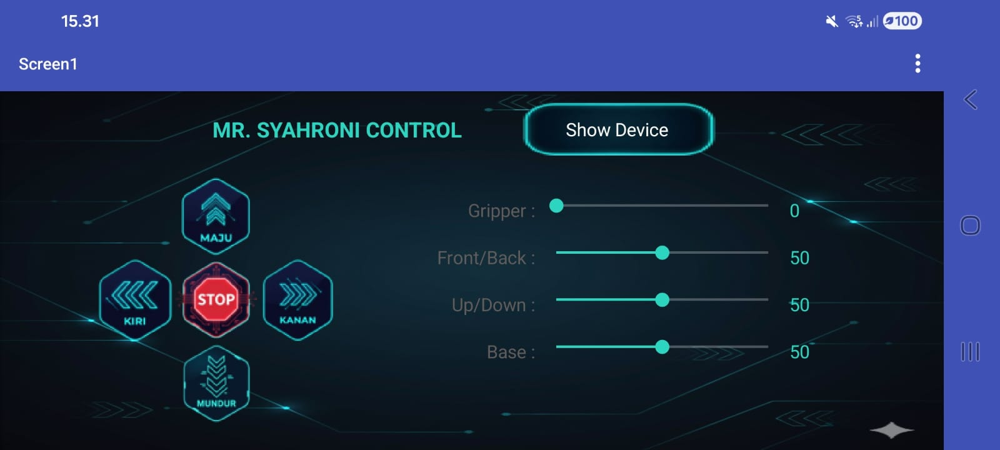

<div align="center">

# 🤖 Final Project Magang Tim Robotika RIVAL ITS

## ArUco Marker Detection & Mobile Robot Control

### Magang Tim Robotika RIVAL ITS

</div>

---

# Deskripsi Proyek

Proyek ini merupakan implementasi sistem **Computer Vision berbasis OpenCV** yang digunakan untuk mendeteksi **ArUco Marker** secara real-time menggunakan kamera IP.

Sistem mendeteksi marker, mengidentifikasi ID marker, menentukan posisi pusat (center point), dan menampilkan hasil deteksi pada layar. Informasi posisi marker dapat digunakan sebagai dasar navigasi robot, pelacakan objek, maupun sistem kontrol otomatis.

Sebagai antarmuka pengguna, proyek ini juga dilengkapi dengan aplikasi Android yang dibuat menggunakan **MIT App Inventor**, sehingga robot dapat dikendalikan melalui perangkat mobile.

---

# Tujuan Proyek

* Mengimplementasikan deteksi ArUco Marker menggunakan OpenCV.
* Menentukan ID marker secara real-time.
* Menghitung titik pusat marker.
* Menampilkan visualisasi hasil deteksi.
* Mengintegrasikan Computer Vision dengan sistem robotika.
* Mengembangkan antarmuka kontrol robot berbasis Android menggunakan MIT App Inventor.

---

# Teknologi yang Digunakan

| Teknologi        | Keterangan                   |
| ---------------- | ---------------------------- |
| C++              | Bahasa pemrograman utama     |
| OpenCV           | Library pengolahan citra     |
| ArUco Module     | Deteksi marker               |
| IP Webcam        | Sumber video dari smartphone |
| MIT App Inventor | Pembuatan aplikasi Android   |
| Computer Vision  | Pengolahan citra real-time   |

---

# Kode Program
```cpp
#include<iostream>
#include<vector>
#include<opencv2/opencv.hpp>
#include<opencv2/aruco.hpp>
using namespace std;
using namespace cv;

int main(){
    VideoCapture cam("http://10.124.28.141:8080/video");    
    if(!cam.isOpened()){
        cout << "Error: Tidak dapat mengakses kamera!" << endl;
        return -1;
    }
    Ptr<aruco::Dictionary> dictionary = aruco::getPredefinedDictionary(aruco::DICT_5X5_1000);    
    Mat frame;
    while(true){
        cam >> frame;
        if(frame.empty()){
            cout << "Error: Frame kosong!" << endl;
            break;
        }
        //Deteksi ArUcoMarker
        vector<int> markerIds;
        vector<vector<Point2f>> markerCorners;
        vector<vector<Point2f>> rejectedCandidates;
        
        aruco::detectMarkers(frame, dictionary, markerCorners, markerIds);
        aruco::drawDetectedMarkers(frame, markerCorners, markerIds);
            
        for(size_t i=0; i<markerIds.size(); i++){
            Point2f center = (markerCorners[i][0] + markerCorners[i][1] + markerCorners[i][2] + markerCorners[i][3]) / 4;
        
            //ID ArUcoMarker & titik pusat
            string text = "ID: " + to_string(markerIds[i]);
            putText(frame, text, Point(center.x - 30, center.y - 20), 
                    FONT_HERSHEY_SIMPLEX, 0.6, Scalar(0, 255, 0), 2);
            circle(frame, center, 5, Scalar(0, 0, 255), -1);
            cout << "Marker ID: " << markerIds[i] 
                     << " | Center: (" << center.x << ", " << center.y << ")" << endl;
                
            //Kotak ArUcoMarker         
            for(int j=0; j<4; j++){
                    line(frame, markerCorners[i][j], markerCorners[i][(j+1)%4], 
                         Scalar(255, 0, 0), 2);
                }
            }
        imshow("ArUco Marker Detection", frame);
        if(waitKey(1) == 27){
            break;
        }
    }
    cam.release();
    destroyAllWindows();
    return 0;
}
```

---

# Controller Android

Aplikasi Android dikembangkan menggunakan **MIT App Inventor** sebagai antarmuka kontrol robot.

## Fitur Controller

### Navigasi Robot

* Maju
* Mundur
* Kiri
* Kanan
* Stop

### Kontrol Manipulator

* Gripper
* Front / Back
* Up / Down
* Base Rotation

### Monitoring

* Show Device
* Menampilkan perangkat yang terhubung

---

# Tampilan Controller


---

# Kesimpulan

Final Project Robotika RIVAL ITS ini berhasil mengintegrasikan Computer Vision dan Mobile Control dalam satu sistem robotika. Dengan memanfaatkan OpenCV dan ArUco Marker Detection, robot mampu mengenali marker secara real-time dan memperoleh informasi posisi yang dapat digunakan untuk navigasi. Selain itu, aplikasi Android berbasis MIT App Inventor memberikan antarmuka yang intuitif untuk mengendalikan robot secara jarak jauh.